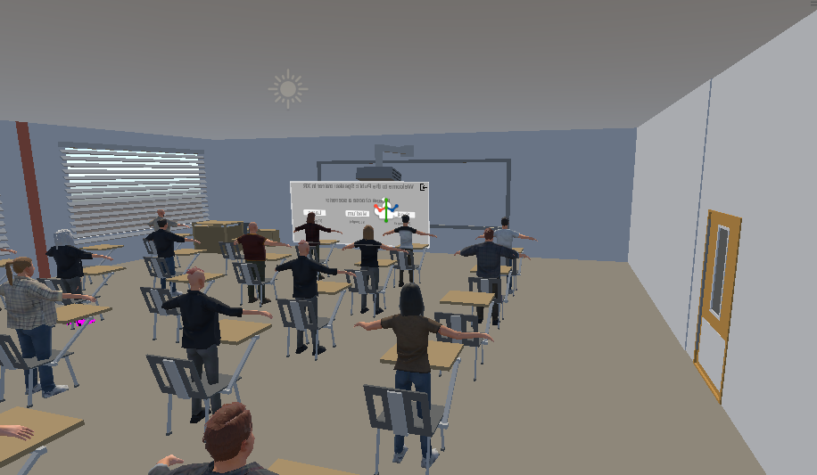
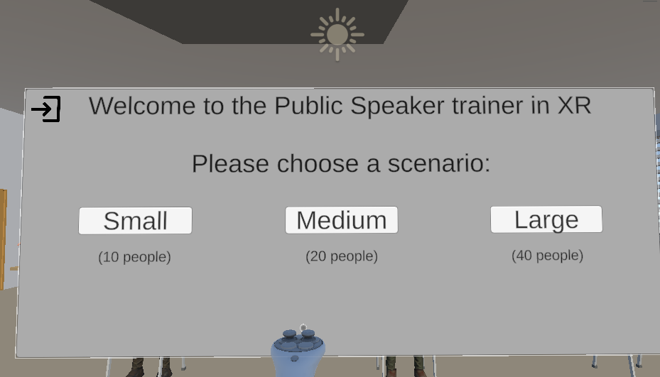
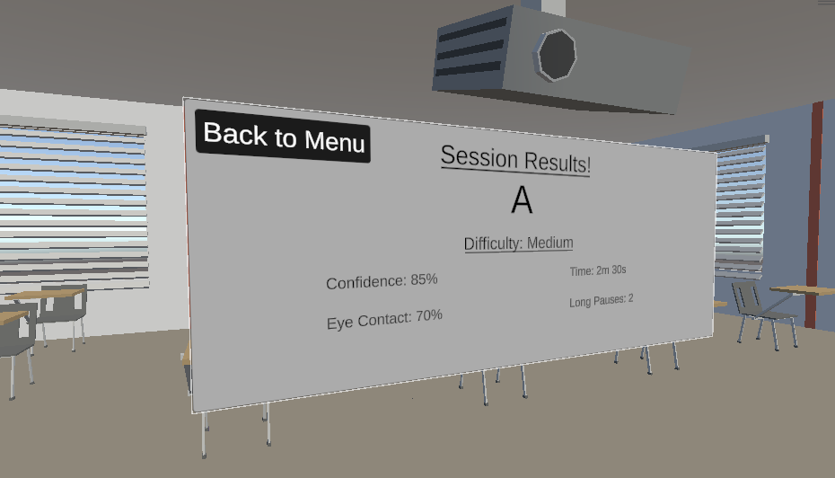

# VR Public Speaking Trainer
An adaptive XR game built in Unity that helps users practice and improve their public speaking skills through immersive virtual reality exposure training.

---




## Overview
**Developed with Unity version 6000.3.9f1**

Public speaking anxiety is one of the most common challenges people face. This project applies exposure-based training — a core principle in cognitive behavioral therapy (CBT) — through a safe, repeatable, and controllable VR environment.

The user delivers a short presentation in front of a virtual audience. The system monitors speaking activity, silence patterns, and gaze direction to estimate presentation confidence and provide meaningful performance feedback after each session.

---

## Features

- 🎤 **Microphone tracking** — detects speaking activity, volume and long pauses in real time
- 👀 **Gaze tracking** — measures how often the presenter looks at the audience using head direction
- 📊 **Confidence scoring** — combines metrics into a live confidence score
- 🎓 **Performance grading** — grades sessions from A to F based on confidence score
- 📋 **Session results** — displays stats after each session including eye contact %, long pauses and time
- 💾 **CSV logging** — automatically logs every session to a CSV file for analysis
- 🚪 **Interactive door** — grab the classroom door to end the session and return to the main menu
- 🗂️ **Three difficulty modes** — Small (10 people), Medium (20 people) and Large (40 people) audiences
- 📱 **In-VR pause menu** — press the left controller menu button at any time to switch scenarios or quit

---

## Scenes

| Scene | Description |
|---|---|
| `MainMenu` | Scene selection menu and post-session results display |
| `Small_Classroom` | 10 NPC audience members |
| `Medium_Classroom` | 20 NPC audience members |
| `Large_Classroom` | 40 NPC audience members |

---

## Scripts

| Script | Description |
|---|---|
| `GameManager.cs` | Singleton that persists across scenes and stores session stats |
| `MicrophoneTracker.cs` | Reads microphone input to detect speaking activity and long pauses |
| `GazeTracker.cs` | Tracks whether the player is looking at the audience using dot product |
| `ConfidenceManager.cs` | Combines mic and gaze metrics into a live confidence score |
| `InteractableDoor.cs` | Saves session stats and loads MainMenu when the door is grabbed |
| `SceneMenuManager.cs` | Handles scene navigation and the in-VR pause menu |
| `ResultsManager.cs` | Displays post-session results and grade on the MainMenu canvas |
| `SessionLogger.cs` | Appends session data to a CSV file on disk |

---

## Confidence Score Formula

```
Confidence = (0.4 × normalizedVolume) + (0.6 × gazePercentage) - pausePenalty
```

- Each long pause (>3 seconds) applies a 5% penalty
- Maximum pause penalty is capped at 30%
- Score is clamped between 0 and 1

### Grading

| Grade | Confidence Score |
|---|---|
| A | ≥ 75% |
| B | ≥ 60% |
| C | ≥ 45% |
| D | ≥ 30% |
| E | ≥ 15% |
| F | < 15% |

---

## Session Metrics Tracked

- **Confidence Score** — final weighted score at end of session
- **Eye Contact %** — percentage of time spent looking at the audience
- **Long Pauses** — number of silences exceeding 3 seconds
- **Session Time** — total time spent in the classroom
- **Difficulty** — which audience size was selected

---

## CSV Log

Sessions are automatically logged to:

**PC (Editor):**
```
C:/Users/<name>/AppData/LocalLow/<company>/<project>/vr-session_log.csv
```

**Quest (Build):**
```
/sdcard/Android/data/com.<company>.<project>/files/vr-session_log.csv
```

**CSV Format:**
```
Date, Difficulty, Confidence, EyeContact, LongPauses, Time, Grade
2026-03-10 14:32:01, Small, 78, 82, 1, 187, A
```

---

## Requirements

- Unity 6 or later
- XR Interaction Toolkit 3.3.0
- OpenXR Plugin
- Meta Quest Touch Plus Controller Profile (Quest 3)
- Universal Render Pipeline (URP)
- TextMeshPro
- Meta Quest 2 / 3 headset

---

## Setup

1. Clone the repository
2. Open in Unity (ensure URP and XRI packages are installed)
3. In **Edit → Project Settings → XR Plug-in Management**, enable **OpenXR**
4. Under OpenXR, add **Meta Quest Touch Plus Controller Profile**
5. Open `MainMenu` scene and press Play, or build to your Quest device

---

## Project Structure

```
Assets/
├── _Scripts/
│   ├── GameManager.cs
│   ├── SessionLogger.cs
│   ├── Menu/
│   │   ├── SceneMenuManager.cs
│   │   └── ResultsManager.cs
│   ├── Tracking/
│   │   ├── MicrophoneTracker.cs
│   │   ├── GazeTracker.cs
│   │   └── ConfidenceManager.cs
│   └── Interaction/
│       └── InteractableDoor.cs
├── Scenes/
│   └── ProjectScenes/
│       ├── MainMenu.unity
│       ├── Small_Classroom.unity
│       ├── Medium_Classroom.unity
│       └── Large_Classroom.unity
└── VRTemplateAssets/
```

---

## Justification

This project demonstrates how XR technology can support behavioral training through:

- **Adaptive exposure** — gradually increasing audience sizes as difficulty levels
- **Real-time behavioral feedback** — confidence score driven by actual speaking behavior
- **Performance analytics** — session logging enables progress tracking over time
- **Practical feasibility** — built within a short development timeframe using standard Unity XR tools

---

## Authors
William Sassner Andersson, **williamsassner@outlook.com**
Viggo Halvarsson Skoog, **Viggo.halvarssonskoog@gmail.com**

Developed as part of the DH2310 XR Labs course at KTH Royal Institute of Technology.
